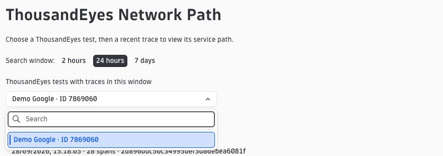
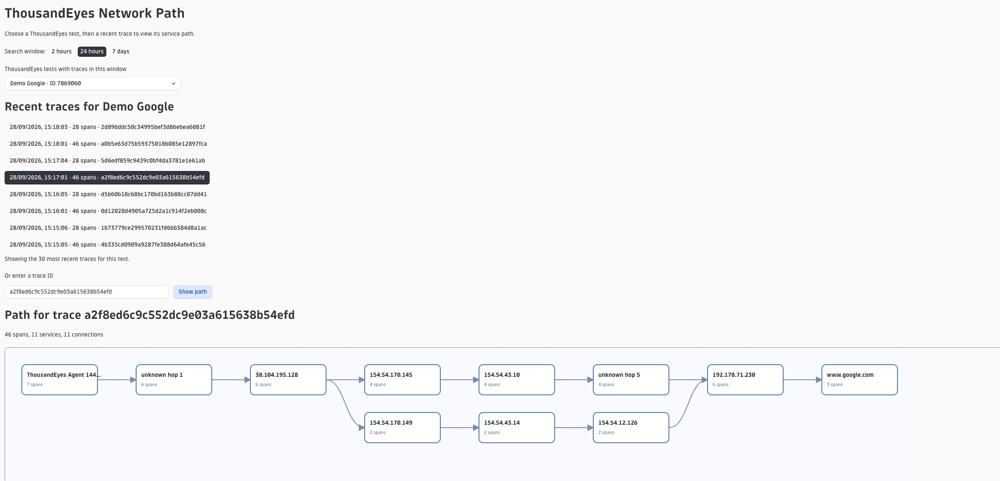

# ThousandEyes Network Path

ThousandEyes Network Path is a Dynatrace App for viewing the Smartscape services observed in one distributed trace. Choose a ThousandEyes test from a searchable dropdown, then choose one of its recent traces. The app queries Grail spans and draws service-to-service links from their parent span relationships. You can also enter a 32-character trace ID directly.

Deployed app: https://hkw74641.apps.dynatrace.com/ui/apps/my.trace.path.map/

Source repository: https://github.com/ajimenez1503/thousandeyes-network-path

This is a trace-specific graph inside a custom app. It does not change or embed the built-in Smartscape graph. A service can appear in multiple traces; the app only draws a link when the selected trace's span hierarchy connects those services.

## Screenshots

Select a test from the searchable dropdown, then select one of its recent traces:



The selected trace is displayed as a connected service path:



These screenshots show sample data from the development environment. Test names, service names, and paths depend on the spans available in your environment.

## Configure your Dynatrace environment

Follow the [installation and configuration guide](docs/SETUP.md) to prepare trace data, point the app at your environment, and deploy it.

## Run locally

Dynatrace App Toolkit currently requires Node.js 24. Install Node.js 24 before developing or deploying the app.

```bash
git clone https://github.com/ajimenez1503/thousandeyes-network-path.git
cd thousandeyes-network-path
npm ci
npm run start
```

The app is configured for `https://hkw74641.apps.dynatrace.com/` in `app.config.json`. The toolkit opens a browser and requests Dynatrace sign-in if necessary. The app and the signed-in user both need access to the spans and Smartscape data.

For the sample data shown during development, choose `Demo Google` or enter trace ID `54864adb27bf9f0fb362add8e14199d6` while it remains in retention.

## Open from another Dynatrace app

The app declares the `view-trace-path` intent with a required `trace_id` string. It accepts that intent at `/intent/view-trace-path` and opens the graph for the provided ID. After deployment, check whether Distributed Tracing offers **Open with > View the trace path** for an individual trace in your tenant. The trace ID input remains available if the source app does not send a compatible intent.

## Build and deploy

```bash
npm run build
npm run lint
npm run deploy
```

Deployment writes the app to the configured Dynatrace environment. Review `app.config.json` and use an account authorized to deploy Dynatrace Apps before running it.

## Data and limits

- Test dropdown: `fetch spans` grouped by `thousandeyes.test.name` and `thousandeyes.test.id`. It loads automatically and can be filtered by name or ID in the dropdown. It lists tests observed in the selected Grail window, up to 10,000 most recently seen tests. Configured tests without spans in that window cannot appear.
- Trace choices: spans for the selected test ID (or name when ID is absent), grouped by `trace.id`. The 30 most recently seen traces are shown.
- Graph query: `fetch spans` filtered by the selected `trace.id`.
- Node identity and label: `dt.smartscape.service` and `getNodeName()`.
- Connections: nearest ancestor span in a different Smartscape service, deduplicated by service pair.
- Search windows: 2 hours, 24 hours, or 7 days.
- At most 10,000 spans are loaded. The app shows a notice if it reaches this limit.
- A missing parent span, missing `dt.smartscape.service`, or expired trace can result in missing connections or an empty graph.

The service nodes can match the nodes in Smartscape, but the edges are derived from this trace's span hierarchy. Smartscape's topology edges can reflect traffic from other traces in the selected timeframe.
